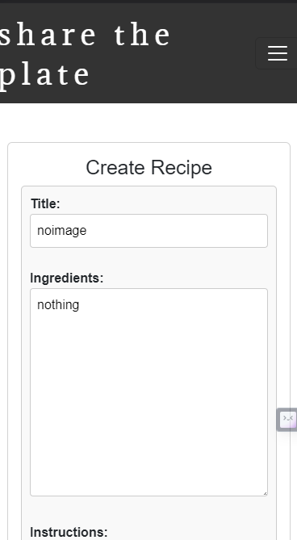

# SHARE THE PLATE

## Table of Contents

- [Introduction](#introduction)
- [UI Decisions](#ui-decisions)
- [Planning and Design](#planning-and-design)
  - [Wireframes](#wireframes)
    - [Homepage](#homepage)
    - [UserLogin](#userlogin)
    - [Recipe List View](#recipe-list-view)
    - [Full Recipe View](#full-recipe-view)
    - [Recipe Management](#recipe-management)
  - [ERD (Entity-Relationship Diagram)](#erd--entity-relationship-diagram-)
  - [Use Cases](#use-cases)
- [Features](#features)
  - [Create a new user](#create-a-new-user)
  - [Login as a user](#login-as-a-user)
  - [Main menu function](#main-menu-function)
  - [Add a recipe](#add-a-recipe)
  - [Remove a recipe](#remove-a-recipe)
  - [Update a recipe](#update-a-recipe)
  - [Display recipes](#display-recipes)
  - [Search for recipes](#search-for-recipes)
- [Features left to implement](#features-left-to-implement)
- [Technology Used](#technology-used)
  - [Python](#python)
    - [Libraries](#libraries)
  - [Django](#django)
- [Testing](#testing)
  - [Python Linting](#python-linting)
  - [Manual Feature Testing](#manual-feature-testing)
- [Bugs](#bugs)
- [Deployment](#deployment)
  - [Cloning and Forking](#cloning-and-forking)
  - [Local Deployment](#local-deployment)
  - [Remote Deployment](#remote-deployment)
- [Credits and Acknowledgements](#credits-and-acknowledgements)

[Table of contents generated with markdown-toc](http://ecotrust-canada.github.io/markdown-toc/)

## Introduction

Share The Plate is a Django-based web application that allows users to create, update, search, and share their favourite recipes. Each user has their unique profile, which stores their added recipes. A user's recipe includes information such as title, ingredients, cooking instructions, cooking time, difficulty level, and an optional image. Users can also like and comment on other users' recipes, creating a sense of community and encouraging recipe sharing.

## UI Decisions

The user interface is clean and straightforward, focusing on functionality and ease of use. It uses standard web forms for user input, providing validation feedback where necessary. The user's home page displays a list of their recipes, which can be viewed, edited, or deleted. Each recipe's detail page displays all information about the recipe, along with user comments and the option to 'like' the recipe. Users can navigate the site through a user-friendly navigation bar.

## Planning and Design

In the planning and design phase, I started with initial wireframes to visualize the layout and interface of various pages of our application. I also designed an Entity-Relationship Diagram (ERD) to outline the structure of the database. Lastly, I defined the primary use cases of our application to guide the overall design and functionality.

### Wireframes

Wireframes serve as the basic structure of the application's user interface, providing an overview of the layout, functionality, and intended user flow across the website.

#### Homepage

The homepage serves as the landing page for the application. It includes a navigation bar and a description of the site with an invitation to join as a user.

#### UserLogin

The User login page allows input of email and password to log in as a user of the site. If a visitor has not created an account there will be a button to direct them to a sign up form where they can create their account.

#### Recipe List View

The Recipe List View page displays a list of recipes either ordered by most recently submitted or based on a search query. Each recipe card displays a summary of the recipe and an option to view the full recipe.

#### Full Recipe View

The Full Recipe View page provides a detailed view of a specific recipe. It includes the recipe's ingredients, steps, cooking time, difficulty, comments, and an option to 'like' the recipe.

#### Recipe Management

The Recipe Management page allows users to add, edit, or delete their recipes. It contains a form for recipe details along with validation feedback.

### ERD (Entity-Relationship Diagram)

The ERD for the database models was created to map out the structure of our database, showing the entities (tables), their attributes (fields), and the relationships between entities.

### Use Cases

Use cases help in identifying the different types of users of our application and what they might want to achieve. Here are a few use cases:

- A new visitor wants to browse for recipes.
- A returning user wants to log in and add a new recipe.
- A user wants to search for recipes by ingredient or category
- A user wants to update the details of their recipe.
- A user wants to comment on or 'like' a recipe.

## Features

This section explains each part of the project and the value it brings to achieving the project goal.

### Create a new user

The registration function allows users to create a new account using their email, a unique username, and a password. The function includes form validation to ensure data integrity and uses Django's authentication system for password security. Upon successful registration, a user profile is automatically created for the user.

### Login as a user

Users can log in to their existing accounts by providing their username and password. The login system uses Django's authentication framework, providing security and session management.

### Main menu function

After logging in, the user is directed to their profile page, where they can view their recipes. They can also navigate to different areas of the site using the navigation bar.

### Add a recipe

Users can add a new recipe by filling out a form with the recipe's details. The form includes fields for the recipe's title, ingredients, instructions, cooking time, difficulty level, and an optional image. The form includes validation to ensure all required fields are filled out correctly.

### Remove a recipe

Users can delete any of their recipes by going to the recipe's detail page and clicking the 'Delete' button. The user is asked to confirm the deletion to prevent accidental data loss.

### Update a recipe

Users can edit any of their recipes by going to the recipe's detail page and clicking the 'Edit' button. This takes them to a form pre-populated with the recipe's current details. The user can update any of the recipe's fields and save the changes.

### Display recipes

Each recipe with have a detail page with ingredients, instructions, tags etc and the option for the author to edit or delete it.

### Search for recipes

Users can search for recipes by title using the search bar. The search function returns any recipes that match the search term and displays them in a list.

## Features left to implement

Future implementations may focus on enhancing user interaction and engagement by introducing features like recipe rating, social sharing, advanced search filters, user profile customization, recipe collections and analytics. These additions will create a thriving community of food enthusiasts who can share their passion for cooking and discover a wide range of delicious recipes.

## Technology Used

### Python

#### Libraries

##### Django

Django is the main framework used for this project. It is a high-level Python web framework that encourages rapid development and clean, pragmatic design. It includes tools for user authentication, form handling, admin interface, and more.

##### Django Crispy Forms

This library is used to control the rendering behavior of Django forms in a DRY way. It allows us to quickly style forms using various CSS frameworks with minimal code, helping to maintain a clean and efficient workflow.

##### Django Taggit

A reusable Django application designed to handle simple tagging. This application is used for adding, retrieving, updating, and deleting tags in the application.

##### Cloudinary

This is a cloud-based service that provides an end-to-end image and video management solution including uploads, storage, manipulations, optimizations and delivery. In this project, it's used for handling image uploads and serving.

##### psycopg2-binary

This library is used as the PostgreSQL database adapter for Python. It enables Django to interact smoothly with PostgreSQL.

## Testing

### Python Linting

All code passed through PEP8 linter (pylint) with no errors

### Feature Testing

All manual test cases can be found in [TESTING.md](./TESTING.md)

## Bugs

No known bugs remaining

## Deployment

This section describes the process of obtaining a copy of this project's files in a new repository, running an environment to work on the site, and deploying to a live platform.

### Cloning and Forking

- At the top of the repository page, select "Fork" and choose a name for the new repository to create a copy.

- Alternatively, select "Code" above the file viewer and either use the link to pull a copy of the code or download the code as a zip file.

### Local Deployment

- Clone or download the repository files.

- Open in a development environment like Gitpod or Codeanywhere

- Install the necessary packages using `pip install -r requirements.txt`

- Migrate the database using `python manage.py migrate`

- Create a superuser for the Django admin using `python manage.py createsuperuser`

- Run the server using `python manage.py runserver`

### Remote Deployment

To deploy the application on Heroku and ensure that all features work as expected, follow these steps:

- Create a new Heroku app.

- Set up the necessary Config Vars in the Settings tab.

- Connect your GitHub account and select the repository to be deployed.

- Choose either manual deployment or enable automatic deployment.

The live link can be found [here](https://share-the-plate.herokuapp.com/)

## Credits and Acknowledgements

All credits go to the Django and Python communities for their robust and easy-to-use libraries that made this project possible. Thanks also to my mentor for their guidance and advice throughout the project.
